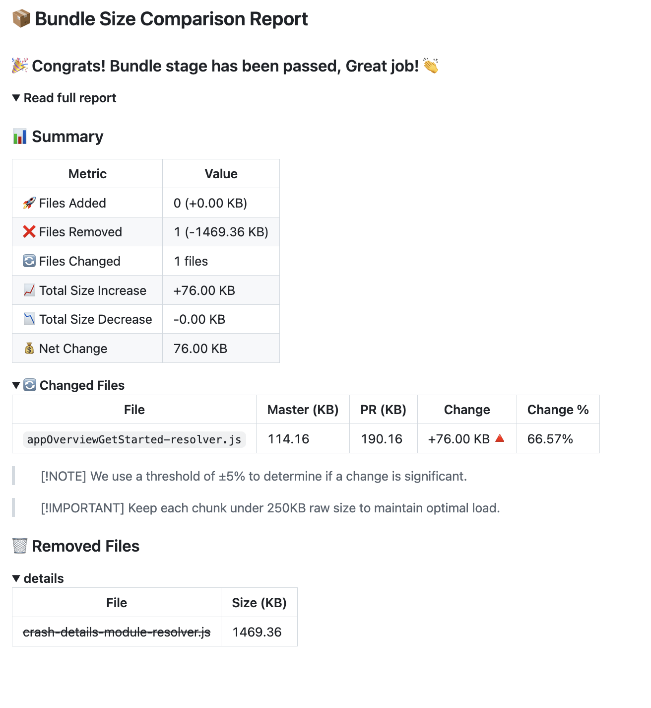
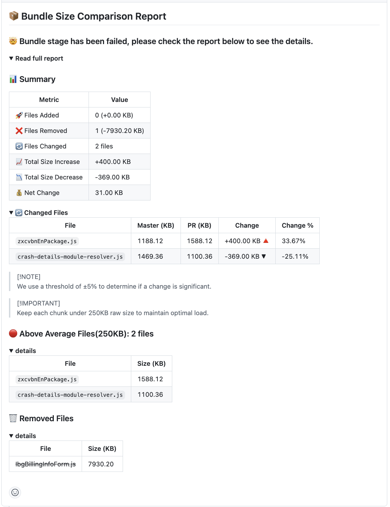

## simple-bundle-diff-reporter

Simple, zero-dependency bundle size diff-reporter that compares your current build against a baseline (e.g., master/main) and generates a rich Markdown report. It flags files that changed significantly, were added/removed, and highlights bundles that are too large or too small to split.

### Why use this?
- **Fast, simple, and framework-agnostic**: Works with any JS build output folder.
- **Actionable report**: Clear summary + drill-down sections in Markdown.
- **Enforce size budgets**: Fail CI when bundles exceed limits or are undersized.
- **Hash-safe comparison**: Normalizes hashed filenames so diffs remain meaningful.


## Installation

```bash
npm i -D simple-bundle-diff-reporter
# or
yarn add -D simple-bundle-diff-reporter
# or
pnpm add -D simple-bundle-diff-reporter
```


## Quick start

1) Build your project so your bundles exist (defaults to `dist/`).

2) On your baseline branch (e.g., `main`), generate and store the baseline stats:

```js
const BundleReporter = require('simple-bundle-diff-reporter');

const reporter = new BundleReporter({
  buildFolder: 'dist',
  outputFolder: 'bundle-diff-reporter',
  masterFile: 'master-bundle-stats.json',
  currentFile: 'current-bundle-stats.json'
});

reporter.generateBundleStats();
// rename the output bundle-diff-reporter/current-bundle-stats.json to master-bundle-stats.json
```

Commit the generated `bundle-diff-reporter/master-bundle-stats.json` to your repo (or store as an artifact accessible in CI).

3) On your feature/PR branch, after building, generate the current stats and the comparison report:

```js

const BundleReporter = require('simple-bundle-diff-reporter');

const reporter = new BundleReporter({
  buildFolder: 'dist',
  outputFolder: 'bundle-diff-reporter',
  masterFile: 'master-bundle-stats.json',
  currentFile: 'current-bundle-stats.json'
});


// Writes bundle-diff-reporter/current-bundle-stats.json
reporter.generateBundleStats();

// Writes bundle-diff-reporter/bundle-size-report.md 
reporter.generateReport();

```


### Options

| Option | Type | Default | Description |
| --- | --- | --- | --- |
| buildFolder | string | "dist" | Folder containing your built JS files. |
| outputFolder | string | "bundle-diff-reporter" | Where to write all outputs. |
| changeThreshold | number | 5 | Minimum % size change to count a file as "changed" in the report. |
| splittingUpperLimit | number (KB) | 250 | Files larger than this are flagged as above average. |
| splittingLowerLimit | number (KB) | 20 | Split chunks smaller than this are flagged as below average. |
| masterFile | string | "master-bundle-stats.json" | Baseline stats filename inside `outputFolder`. |
| currentFile | string | "current-bundle-stats.json" | Current stats filename inside `outputFolder`. |
| outputFile | string | "bundle-size-report.md" | Markdown report filename inside `outputFolder`. |
| failureFile | string | "bundle-diff-stage-failed.txt" | Created when the check fails. |
| aboveAverageFiles | string[] | [] | Allowlist: filenames that may exceed `splittingUpperLimit` without failing. |
| belowAverageFiles | string[] | [] | Allowlist: filenames that may be below `splittingLowerLimit` without failing. |

Notes:
- Filenames are normalized (e.g., hashed suffixes/chunk markers are removed) to make comparisons stable between builds.
- Files containing `"resolver"` in the name are ignored for the below-average check by default.


## Outputs

All outputs go to `outputFolder` (default `bundle-diff-reporter/`):

- `master-bundle-stats.json` — Baseline bundle map `{ [fileName]: { size: number(KB) } }`.
- `current-bundle-stats.json` — Current bundle map, same shape, sorted by size.
- `bundle-size-report.md` — Human-friendly Markdown report with collapsible sections.
- `bundle-diff-stage-failed.txt` — Only written when the check fails.


## Report preview

Below is an example of the generated report. It contains:
- **Header + pass/fail message**
- **Summary** table
- **Changed Files** (with threshold note and size budget reminder)
- **Above Average Files** (exceed `splittingUpperLimit`)
- **Below Average Files** (below `splittingLowerLimit`)
- **New Files**
- **Removed Files**


##### Success example

##### Failure example



## Suggested CI usage (example)

Run after your build step. If the diff-reporter writes the failure flag file, fail the job:

```bash
 stage('generate-bundle-reports') {       
            // build the app to generate dist
            sh '''#!/usr/bin/env bash
              set -x
              export NODE_OPTIONS="--max-old-space-size=4096"
              yarn build
            '''

            // Download with retries
            retry(3) {
                s3Download(
                  bucket: 's3-bucket-name',
                  path: "s3-bucket-name/master-bundle-stats.json",
                  file: 'bundle-diff-reporter/master-bundle-stats.json',
                )
              }
            // Verify download
            if (!fileExists('bundle-diff-reporter/master-bundle-stats.json')) {
              error("Master bundle stats file missing after download")
            }
            else {
                sh '''#!/usr/bin/env bash
                  set -x
                  export NODE_OPTIONS="--max-old-space-size=4096"
                  node bundle-diff-reporter/index.js
                '''
                def report = readFile file: 'bundle-diff-reporter/bundle-size-report.md'
                pullRequest.comment("${report}") // to comment the output of bundle-diff-reporter as PR comment
                if (fileExists('bundle-diff-reporter/bundle-diff-stage-failed.txt')) {
                  error("🔴 Failed to pass bundle size check")
                }
              }
          }
```


## FAQs

- **Do I need to commit the baseline file?**
  You can commit `bundle-diff-reporter/master-bundle-stats.json` or fetch/store it via CI artifacts. The diff-reporter needs access to it when running comparisons.

- **What files are analyzed?**
   `.js` files in `buildFolder`. Filenames are normalized by removing common hash/chunk patterns.

- **Can I ignore specific files for size budgets?**
  Yes. Use `aboveAverageFiles` and `belowAverageFiles` to allowlist exceptions.


## License

MIT


